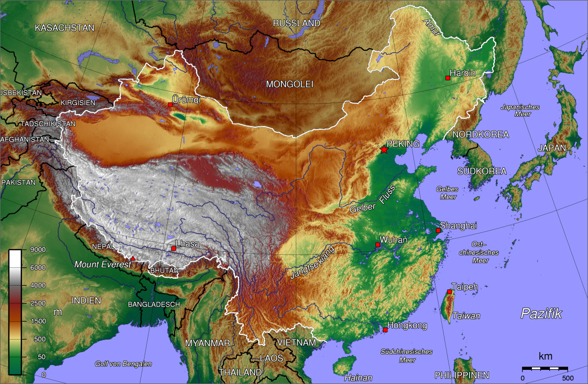

# 《地理大发现》读书笔记

## 1 起因

地理大发现的起因是

1）欧洲太贫瘠了，资源匮乏，导致需要与其他地区的贸易来。
道理就是：资源匮乏的地方，往往就是商业发达，人民富有冒险精神，富有侵略精神（有殖民地）。
希腊就是因为山地崎岖。
而中国是资源丰富的国家，不需要和其他国家贸易，然后就是探索不足，导致的落后。
而温州是中国商业的代表，而温州本身就是山地众多，除了经商，别无出路。

2）陆上贸易，很早就有了，但是后来被奥斯曼帝国和阿拉伯帝国给堵住了。

亚历山大、班超甘英、东罗马帝国、阿拉伯贸易、蒙古帝国、马可波罗

### ps1：
上面的论述其实是逻辑不正确的，因为很容易举出反例：温州是山地众多所以商业发达，那么中国西北西南也是山区众多，为什么商业没那么发达呢？
我们再补充一个观点：就是温州这些地方有它们的优势，就是靠海。海洋促进贸易的诞生。

### ps2：

接上，继续思考一下。

有海的地方，基本都有山。也就是说，地势崎岖。

这些基本都是地壳运动的原因。
地球上的海洋将各大洲连接起来，其实本质是，如果地球上去掉所有的水，陆地本身就是联系在一起的，换句话说，地球就是个土疙瘩（认真起来，“土疙瘩”的说法肯定是不对的，应该是个铁疙瘩，或者金属疙瘩，有了另外一个问题：土壤是怎么来的？），
有了水之后，水覆盖掉了那些地势低的地方，然后就将地球隔离成了几个岛，或者叫做“洲”。由于人不能在水中自然生存，所以水就形成了一种隔离，促使大家向内地发展，当然也有部分人会向着海洋的方向发展，做连接各大洲的生意，而且由于风险，
往往利益颇丰（为什么风险高的商业，收益都比较高呢？我的理由是：一方面肯定是物有所需，需求决定价值，所以有收益；另一方面是由于高风险，会将很多人都筛出掉，起到了门槛的作用，所以高收益）。

这些地方发展农业都比较困难。

### ps3：
接上。

现在想想，其实土地肥沃、地势平坦、适合农业发展的地方，都是可遇不可求的，都是上帝宠爱的地方。

你看看中国的地势（见下图），平原地方其实很少的，就是

1）黄河中下游。也就是古老中国的发源地 --- 陕西一小部分（关中平原）、河北、河南、山东，

2）淮河流域。安徽、江苏，

3）洞庭湖流域，湖北，湖南 ，

4）加上东北平原。

## 2 事件

就是14xx年末和15xx开始的几年，地理大发现的事件频繁发生。

所以说，事件在时间轴书上的密度是不一样的。

​	1). 1486年 葡萄牙迪亚士到达好望角

​	2). 1498年 葡萄牙达伽马到达印度，运回大量货物，获利60倍

​	3). 1500年 葡萄牙卡布拉尔首次到达巴西

​	4). 1505年 葡萄牙阿美达为第一任驻印总督

​	5). 1509年 葡萄牙阿布克尔克占领印度的果阿港

​	6). 1511年 葡萄牙人占据马六甲

​	7). 1517年 葡萄牙安得拉德到达广州

​	8). 1543年 葡萄牙人首次到达日本

## 3 探险与知识

做的探险越多，掌握的知识越多，精神上积攒下来的财产就越多。

## 4 美洲的落后

美洲在哥伦布发现时，还处于石器、青铜器的时代，不知道铁器。

## 5 国家的概念

地理大发现之前，欧洲各国好像才刚刚建立民族国家。也就是说，”国家“的概念才刚刚形成没多久。

这个或许跟罗马帝国的崩溃是同时进行的。

## 6 美洲的文明

美洲没有形成强大的国家。

美洲也有自己的文明，比如玛雅人、阿兹特克人、印加人。

美洲人民也培育了很多的植物，像玉米、土豆、番茄、可可、花生、烟草等，引进到其他国家后，带来了很大的影响。

美洲没有马、牛、羊、猪。

西班牙人对这些国家带来了毁灭性的打击，好像历史上的那些恶事都是西班牙人干的。